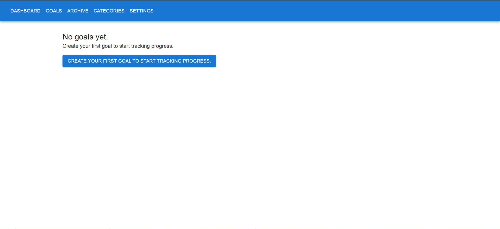
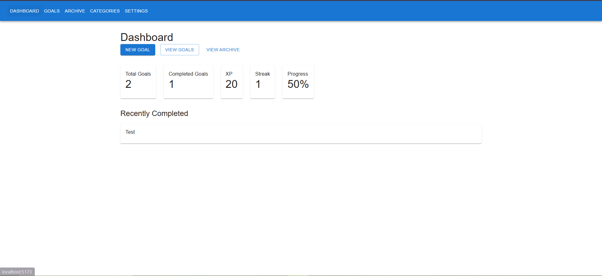
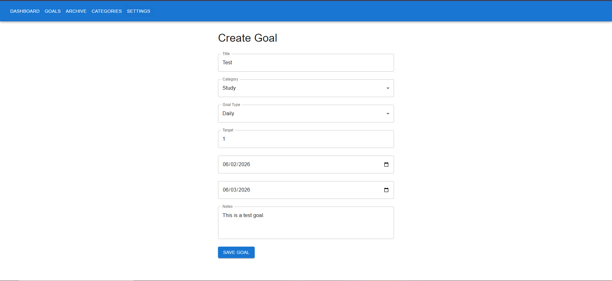
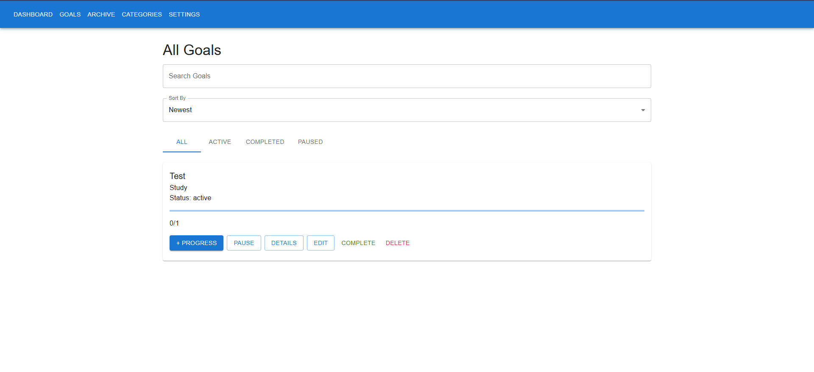
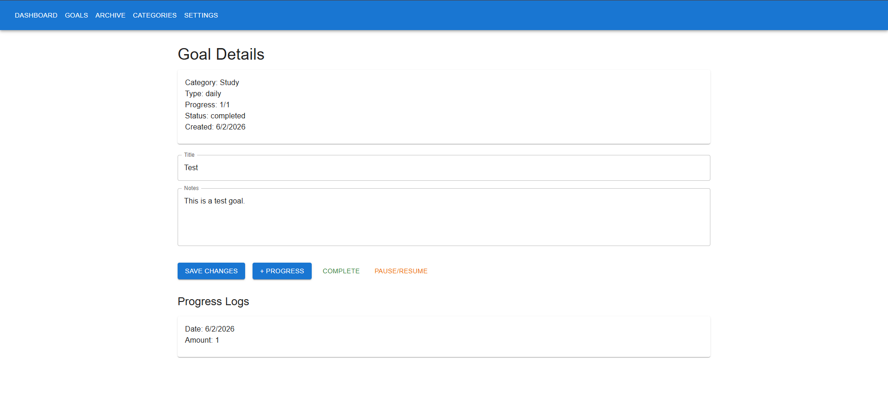
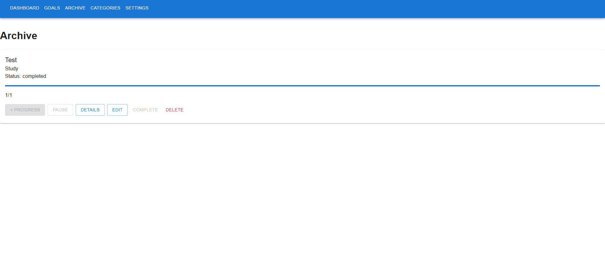
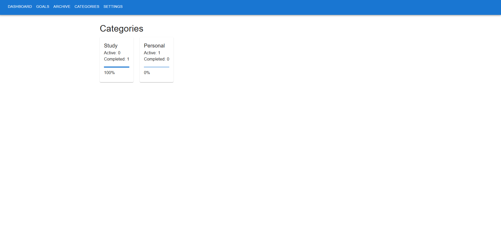
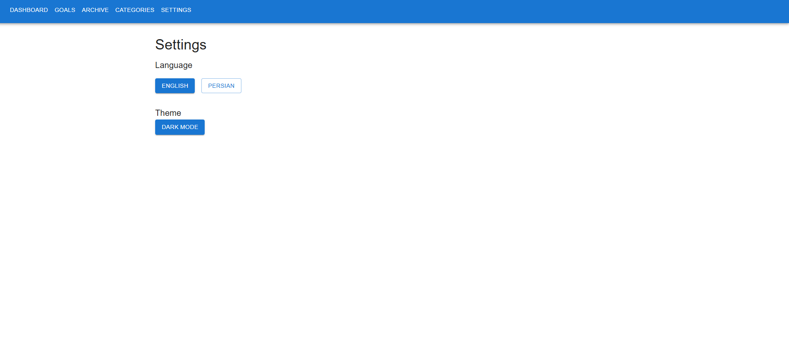
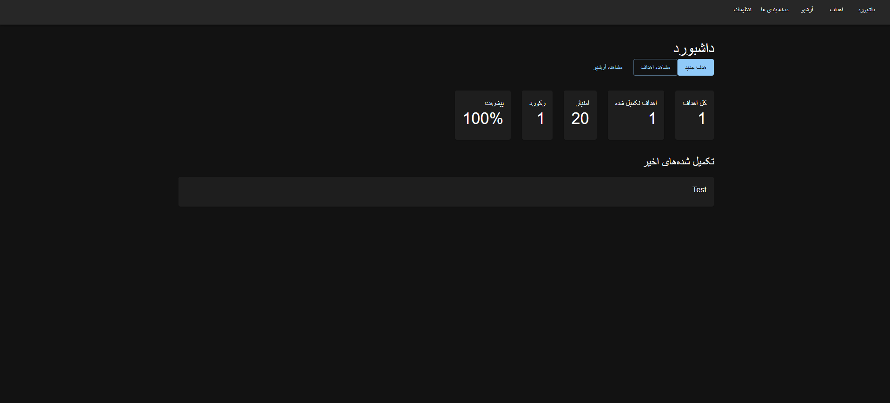

# Goal Tracker

A modern goal management and productivity application built with Angular and Angular Material. Goal Tracker helps users create goals, monitor progress, build streaks, earn XP, and stay motivated through a clean and responsive interface.

---

## Features

- Create, edit, and delete goals
- Track goal progress with progress logs
- Pause and resume active goals
- Complete goals and automatically archive them
- Organize goals using categories
- Dashboard with productivity statistics
- XP and streak reward system
- English and Persian language support
- RTL support for Persian
- Light and Dark themes
- Responsive Material Design interface
- Local storage persistence

---

## Screenshots

### Empty Dashboard

Start your journey by creating your first goal.



---

### Dashboard

Overview of your productivity statistics including total goals, completed goals, XP, streaks, and completion rate.



---

### Create Goal

Create a goal by defining its title, category, target, dates, and notes.



---

### All Goals

Manage all active goals from a single page.

Features include:

- Search goals
- Sort goals
- Filter goals by status
- Add progress
- Pause goals
- Edit goals
- Complete goals
- Delete goals



---

### Goal Details

View detailed information about a goal and manage its progress.

Features include:

- Goal information
- Progress tracking
- Progress logs
- Goal status management
- Edit functionality



---

### Archive

Completed goals are automatically moved to the archive where users can review their achievements.



---

### Categories

Track performance across different categories and view completion percentages.



---

### Settings

Customize application preferences.

Available options:

- English Language
- Persian Language
- Light Theme
- Dark Theme



---

### Persian Language & Dark Mode

The application fully supports Persian (RTL) and Dark Mode.



---

## Application Workflow

### 1. Create a Goal

Create a goal and assign it to a category.

### 2. Track Progress

Add progress entries as you work toward completion.

### 3. Monitor Statistics

View performance metrics from the dashboard.

### 4. Complete Goals

Mark goals as completed and earn XP.

### 5. Build Streaks

Maintain consistency and increase your productivity streak.

### 6. Review Achievements

Access completed goals anytime from the archive section.

---

## Dashboard Metrics

| Metric | Description |
|----------|-------------|
| Total Goals | Total number of goals |
| Completed Goals | Successfully completed goals |
| XP | Experience points earned |
| Streak | Current productivity streak |
| Progress % | Overall completion rate |

---

## Tech Stack

- Angular
- Angular Material
- TypeScript
- RxJS
- SCSS
- HTML5
- Local Storage

---

## Localization

Supported Languages:

- English (LTR)
- Persian (RTL)

The application automatically adapts its layout based on the selected language.

---

## Themes

Available Themes:

- Light Mode
- Dark Mode

Users can switch themes from the Settings page.

---

## Project Structure

```text
Goal-Tracker/
├── assets/
│   ├── Dashboard.PNG
│   ├── EmptyDashboard.PNG
│   ├── CreateGoal.PNG
│   ├── AllGoals.PNG
│   ├── GoalDetails.PNG
│   ├── Archive.PNG
│   ├── Categories.PNG
│   ├── Settings.PNG
│   └── Perian_DarkMode.PNG
├── public/
├── src/
├── package.json
├── vite.config.js
└── README.md
```

## Installation

Clone the repository:

```bash
git clone <repository-url>
```

Navigate to the project directory:

```bash
cd Goal-Tracker
```

Install dependencies:

```bash
npm install
```

Run the development server:

```bash
npm run dev
```

Open your browser and navigate to:

```text
http://localhost:5173
```

---

## Purpose

Goal Tracker was created to help users:

- Stay focused on long-term goals
- Build productive habits
- Monitor progress effectively
- Stay motivated through rewards and streaks
- Review accomplishments over time

---

## License

This project is licensed under the MIT License.

---

### Built with Angular and Material Design to help users stay productive and achieve their goals.
